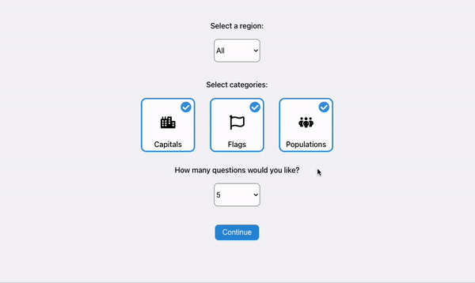

# Geo Quiz



React web app using bundled country data to test your geography knowledge. Choose a region, number of questions, and categories (flags, capitals, populations) to play.

Country data is sourced from [mledoze/countries](https://github.com/mledoze/countries) (independent nations only).

## Technologies

- React 18
- TypeScript
- Vite
- Tailwind CSS
- Vitest
- ESLint & Prettier

## Live demo

[geo-quiz.netlify.app](https://jovial-shockley-ee3800.netlify.app/)

## Development

```bash
npm install
npm start
```

Open [http://localhost:5173](http://localhost:5173).

### Other scripts

| Command | Description |
|---------|-------------|
| `npm test` | Run Vitest once |
| `npm run build` | Type-check and build to `dist/` |
| `npm run preview` | Preview the production build |
| `npm run lint` | Run ESLint |
| `npm run format` | Format with Prettier |

## Deployment

The app is configured for [Netlify](https://www.netlify.com/) via `netlify.toml`. The publish directory is `dist/` (not CRA's old `build/` folder).
